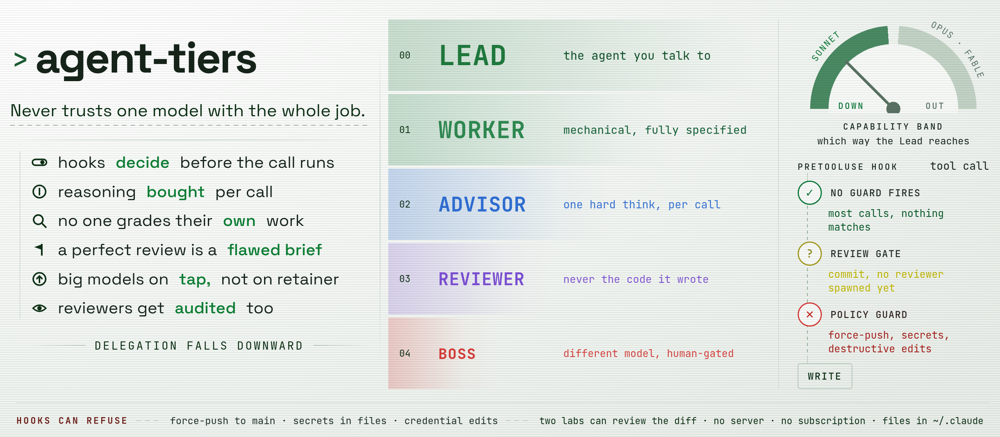

<a name="top"></a>
<p align="center">
  <picture>
    <source media="(prefers-color-scheme: dark)" srcset="./agent-tiers-banner-dark.png">
    <source media="(prefers-color-scheme: light)" srcset="./agent-tiers-banner-light.png">
    
  </picture>
</p>

<p align="center">
  <em>No single model gets the whole job. <strong>Cheap by default.</strong><br>
  <strong>Hooks block the dangerous stuff</strong> before it happens.</em>
</p>

<p align="center">
  <a href="https://github.com/godilley/agent-tiers/actions/workflows/selfcheck.yml"></a>
  <a href="LICENSE"></a>
</p>

<hr>

<p align="center">
  <a href="#see-it-work">See it work</a> ·
  <a href="#what-ships">What ships</a> ·
  <a href="#hooks-and-guards">Hooks</a> ·
  <a href="#install--update">Install</a> ·
  <a href="#companions-optional-power-ups">Companions</a> ·
  <a href="#how-a-project-extends-the-tiers-3-layers">Extend the tiers</a> ·
  <a href="#uninstall--removal">Uninstall</a> ·
  <a href="#history">History</a>
</p>

<hr>

A portable Claude Code plugin that installs a cost-aware sub-agent tier system into any project, and
**self-configures by probing the local environment** - so it works regardless of project state, editor,
or which Claude Code GUI / editor-addon is in use ([why a probe](docs/after-install.md#why-a-probe)).

| Tier | Job |
|---|---|
| **Lead** | The agent you talk to. Routes work rather than doing all of it. |
| **Worker** | Cheap and fast. Handles mechanical, fully-specified jobs. |
| **Advisor** | One hard think, bought per call, when a decision needs real reasoning. |
| **Reviewer** | Checks the diff - whoever wrote it is the worst person to review it. |
| **Boss** | A different model, called in only when the Lead is genuinely stuck. |

Two things this buys. **Cost:** a Sonnet call costs a fraction of an Opus or Fable one (public
per-token pricing - that ratio is the whole mechanism), and the kit makes the cheap Lead the
default without giving up the strong models: they stay on tap, bought per call (an Opus advisor,
a cross-lab review) or per session when the work deserves a cleverer Lead. What that looks like
in practice, for one data point: two out of three of the author's own August sessions start on a
Sonnet lead (lead-model count, the kit's own dev repo excluded). **Safety:** the rules that must not depend on an agent remembering them are wired as
**hooks** your CLI runs before a tool call - force-pushes, secrets, credential edits can be
hard-stopped, not remembered-about (each guard opt-in, one flag). Nothing here needs a server or a
subscription: files in `~/.claude` and POSIX shell.

> [!NOTE]
> Assumes you already know Claude Code plugins, hooks, and subagents - see
> [Anthropic's Claude Code docs](https://docs.claude.com/en/docs/claude-code) first if you don't.

The **Lead** (your main chat) is configured in your GUI's model panel; the default posture is a cheap
Lead (Sonnet at high effort) that converses, routes, briefs, and verifies, buying deeper reasoning
per call. Pick a stronger model for an architecture-heavy session and the doctrine adapts: a strong
Lead reaches *out* for independent review instead of *down* for capability. The kit only configures
and *verifies* the sub-agents; it never pins the Lead's model or effort.

## See it work<a href="#top"></a>

Real captured output, not mockups. The guards are plain scripts reading the hook's JSON from
stdin, so every refusal below is reproducible by piping the same payload yourself.

**A force-push stopped before it runs** (`dangerous-actions-blocker`):

```console
$ printf '{"tool_name":"Bash","tool_input":{"command":"git push --force origin master"}}' \
    | sh scripts/dangerous-actions-blocker.sh
```
```json
{
  "hookSpecificOutput": {
    "hookEventName": "PreToolUse",
    "permissionDecision": "deny",
    "permissionDecisionReason": "Force-push targeting main/master is a hard deny. What to do now: there is no override for this in the session - do not retry a variant or route around it with another tool. Tell the operator what was blocked and why; if they still want it done, they run it themselves in a real terminal."
  }
}
```

Note the reason text: it briefs the *agent* on what to do next, not just the human. A guard that
only says "no" invites the model to try a variant; these close that door explicitly.

**The silent-grep footgun** (`grep-footgun-guard`) denies with the fix in the message:

> Recursive GNU grep without -a/--text silently skips files it deems binary (NUL/invalid bytes;
> plain CJK is fine) - documented CLAUDE.md footgun. Re-run with 'rg' (preferred) or add '-a' to grep.

**A spawn's check-in line** - every tier opens by quoting its tier, live model, and definition
version, so a stale agent definition is visible the moment it speaks:

> Hi, I'm worker - Worker tier, running sonnet at medium reasoning, def-v4. Task: create and
> verify a slugify shell script.

**Doctrine firing mid-session** - rules carry stable ids (`SC-*`), and hooks quote them at the
moment they apply, in the agent's own transcript. This one fired at the session that was building
the kit's own publish gate, the instant it wrote the file:

> agent-tiers SC-5.2: you have now AUTHORED a non-trivial trust-class artifact this session.
> Authorship and the pre-ship verdict are separate roles - you are disqualified as this diff's
> fresh eyes [...] Note the argument that will occur to you and is wrong: 'another review
> pass is low marginal value here' is a statement about the diff you have ALREADY reviewed, never
> about the diff you just authored. This is a record, not a block - deciding not to review is a
> decision worth stating out loud rather than making silently.

The independent review it demanded happened, and found real defects the author had missed.

**And the guards guarded this section's own making**: capturing a secret-write refusal for the
README was itself hard-denied by the authoring session's live guard - a fixture `sk-ant-` key on a
command line looks exactly like a real one, and the guard does not care that you meant well. The
specimen you don't see here is the system working. `sh scripts/security-gate.selfcheck.sh` runs
the full fixture suite instead; it ends `ALL PASS`.

Skeptical? Good - distrust is the posture this kit is built on, and it applies to the kit itself.
Paste the [review prompt](docs/prompts/review.md) into a fresh Claude session: it audits the kit
as inert data and reports, installing nothing.

## What ships<a href="#top"></a>

| What | Ships |
|---|---|
| **Agents** | Lead / Worker / Advisor / Reviewer / Boss, plus optional Codex handoff |
| **Skills** | tier vocab, delegation, session handoff, context-file layout, doc lifecycle |
| **Commands** | `init`, `doctor`, `gc`, `hygiene`, `resume`, `notes`, `unattended` |
| **Config** | a VCS-policy config file |
| **Hooks** | core SessionStart/SessionEnd rows, plus consent-wired PreToolUse guards |
| **Templates + scripts** | env probe, flat install, doctrine lint, notes sync, kit share, selfchecks |

All portable, verbatim, no per-project edits needed. How the kit maintains its own artifacts after
install - staleness stamps, gated curation, VCS policy, the private-notes seam - is
[docs/after-install.md](docs/after-install.md).

<details>
<summary>The item-by-item inventory: agents, skills, commands, kit config, scripts</summary>

- **Agents** - `advisor` (read-only, reasoning, returns a recommendation), `reviewer` (Opus, read-only
  on code, curates noisy first-pass audit drafts into one trustworthy list - a gated escalation), `boss`
  (read-only, human-gated circuit-breaker for a stuck Lead - runs a model DIFFERENT from the Lead's for
  real independence (opus under a sonnet Lead; fable if opus was already implicated); decides, never
  explores), and a
  generic `worker` (cheap/fast, mechanical, follows the brief, never decides). Optional cross-lab
  `codex-read` / `codex-write` (OpenAI Codex handoff - read/generate-only and write paths) ship too.
- **Skills** - `agent-tiers` (tier vocab + the check-in technique & return gotcha), `gating-workflow`,
  `delegation` (+ the build->prove->propagate rollout rule), `session-handoff`, `context-file-layout` (CLAUDE.md +
  context-file structure + a refactor playbook), `doc-lifecycle` (how a private notes-dir doc reaches a
  clean terminal state).
- **Commands:** `init` (set up a project), `doctor` (health + lifecycle report), `gc` (gated curator /
  optimiser), `hygiene` (backfix em/en dashes + invisible chars in a project's files), `resume` (refresh
  the handoff, steerable like `/compact <steer>`), `notes` (private-notes seam), `unattended`
  (flag a session as unattended so a guard `ask` converts to an actionable `deny` instead of halting).
  Full set: `commands/*.md`. Invoked `/agent-tiers:<name>` (plugin) or `agent-tiers-<name>` (flat).
- **Kit config:** `kit-config.md` (your global VCS-policy defaults; created write-if-absent by the flat
  installer). Plugin-path installs don't ship it - consumers fall back to kit defaults (every class
  `ignore-personal`, `agent_memory_project: commit`) when it's absent.
- **Templates + scripts** (env probe, flat install, doctrine lint, notes sync, kit share, per-guard
  selfchecks, `codex-run.sh`).

</details>

## Hooks and guards<a href="#top"></a>

`install-flat.sh` wires every kit hook through ONE ledger-backed mechanism: `.state/integrations.json`
records what the installer owns, re-runs converge on the target state, FOREIGN (hand-edited) rows are
warned about and never touched, and each wired row's selfcheck runs at install ("wired" and "fires" are
different claims).

| Row | Class | What it does |
|---|---|---|
| `resume-inject` | core, auto-wired | Re-injects `RESUME_SESSION.md` |
| `codex-home-isolate` | core, auto-wired | Per-session `CODEX_HOME` |
| `guard-summary` | core, auto-wired | SessionEnd stderr line counting the session's guard blocks from `.state/guards.log`, the durable record |
| `dangerous-actions-blocker` | consent, `--with-<id>` | Hard-denies force-push to main/master, `DROP`/`TRUNCATE DATABASE`, `dd`/`mkfs`, publishes, secret shapes on a command line |
| `security-gate` | consent, `--with-<id>` | Scans content being written - every file type - for secrets and injection-prone patterns |
| `grep-footgun-guard` | consent, `--with-<id>` | Blocks recursive raw `grep`, which silently skips NUL-byte files |
| `review-gate-guard` | consent, `--with-<id>` | Asks at `git commit` when no reviewer/advisor spawn exists this session |
| `codex-guard` | consent, `--with-<id>` | Denies bare `codex`; routes through the `codex-run.sh` wrapper and its secrets scan |

PreToolUse guards are security policy - they run before every matching tool call, so never probe-wired.
Those rows are examples, not the set: the full list is `HOOK_ROWS` in `scripts/install-flat.sh`, and
`/agent-tiers:doctor` step 4f prints which of them are wired here.

> [!IMPORTANT]
> Guards default **OFF** - a misfiring security hook blocks legitimate work, so `--with-<id>` is a
> deliberate choice, not a gap nobody noticed. But every row above exists because of a real caught
> failure, so opt-in should mean "you turned this on", not "nobody got around to it".

The plugin path (`hooks/hooks.json`) ships only the core SessionStart/SessionEnd hooks statically; it wires **no
guards** - a static manifest cannot conditionally wire per machine. Consent guards come from
`install-flat.sh --with-<id>` on either install path, and `/agent-tiers:doctor` step 4f prints
`guards: N of M wired` so absence is visible.

Three things about how this surface is maintained, since you are trusting it with hook access:
every guard ships a fixture-based selfcheck, and CI runs the whole suite under sh, dash and bash
plus a macOS leg, with a SKIP scored as a failure. Network posture, in plain words: the hooks and
guards make zero outbound calls - every deny happens locally and nothing they catch is
transmitted anywhere. The only networked pieces are ones you invoke yourself: `git`, the share
tool pushing to your own remotes, and the two opt-in companions. A selfcontainment preflight blocks shipped
scripts that would arrive broken in a recipient's copy (an unreachable script, a dependency that
only resolves on the maintainer's machine). And each guard's header comment names the real
incident that motivated it - the source carries the story, not a hypothetical threat model.

## Install / update<a href="#top"></a>

| Requirement | Notes |
|---|---|
| POSIX coreutils | Present on any Linux/macOS; `install-flat.sh` preflights the exact set |
| bash 3.2+ | Installer and maintenance scripts |
| `jq` | **Optional** - the hooks + installer degrade gracefully without it |

Easiest path: paste the [install prompt](docs/prompts/install.md) into a Claude Code session and
let your agent drive - it clones to a temp dir, audits, plans, and waits for your confirmation
before writing anywhere. Installing by hand instead, get the kit first:

```bash
git clone https://github.com/godilley/agent-tiers ~/.claude/agent-tiers
```

Then pick one of two paths, depending on whether your host loads `.claude` **plugins**. The
install itself writes only under `~/.claude/`, with two exceptions: a `~/bin/agent-tiers-share`
symlink, and per-session `~/.codex-homes/` dirs from the codex-home-isolate hook. (Running
`/agent-tiers:init` afterwards scaffolds files in the project you run it in - including three
named blocks appended to that project's `CLAUDE.md` - each step confirmed with you.)

### A. Standalone CLI (loads plugins)

The canonical dir doubles as a valid plugin. `/reload-plugins`
loads it without a restart; `claude plugin validate <dir>` checks the manifest. Then run
**`/agent-tiers:init`** in any project.

### B. Plugin-ignoring GUI (e.g. the CodeMoss bundled SDK)

Such hosts silently ignore a `.claude`
plugin wrapper but DO scan plain `~/.claude/{skills,agents,commands}` files. Keep the canonical kit at
`~/.claude/agent-tiers/` and flatten it into those scan dirs:

```bash
bash ~/.claude/agent-tiers/scripts/install-flat.sh
```

Idempotently: symlinks the skills + agents, copies every command as `agent-tiers-<name>` (dodging the
built-in `/init`, plugin-root path baked in), and wires the hook rows through the integrations seam
(core rows automatically; consent guards only with `--with-<id>`, undo with `--without-<id>`). Skills +
commands re-scan live; **new agent types need a host relaunch**. Then run **`/agent-tiers-init`** in any
project. Detect a plugin-ignoring host: `CLAUDE_CODE_EXECPATH` contains `.codemoss` (the probe reports
`host_guess`).

Running a second Claude account? One kit serves every profile via `CLAUDE_CONFIG_DIR` - see
[docs/after-install.md](docs/after-install.md#second-claude-account-claude_config_dir).

> [!WARNING]
> Edit ONLY the canonical files under `~/.claude/agent-tiers/`. Skills + agents are
> symlinks (zero drift); the command copies are regenerated - **re-run `install-flat.sh` after editing
> `commands/*.md`** or you ship stale copies.

## Companions (optional power-ups)<a href="#top"></a>

The kit works standalone; two opt-in companions turn it good -> great, both degrade gracefully:

- **[agentsview](https://github.com/kenn-io/agentsview)** (kenn-io, MIT, user-scope MCP) - a session ledger across every agent run. Pull recent
  runs, search all sessions, and verify what a sub-agent *actually did* (tools, timings, health, cost)
  instead of trusting its summary. The go-to verify/diagnose layer.
- **Codex cross-lab layer** (per-host) - a genuinely different lab for the write path and, especially,
  **dual-lab review**: a fresh opus + a cross-lab Codex pass on the same diff, Lead synthesizes (see
  [the XLAB card](skills/agent-tiers/cards/XLAB.md) - "cards" are this kit's short doctrine-reference
  files under `skills/agent-tiers/cards/`). Two independent minds beat one model reviewing itself.

## How a project extends the tiers (3 layers)<a href="#top"></a>

Tiers ship global and generic; a project extends them **without duplication** via one skill (there's no
native agent `extends`, so the seam is the `skills:` hook):

| Layer | Where | What it is |
|---|---|---|
| **L1 global tiers** | the kit's own agent files | each declares `skills: [tier-project-brief]` |
| **L2 project brief** | `.claude/skills/tier-project-brief/SKILL.md` | One per repo: build/test/verify + landmines. Absent -> graceful skip |
| **L3 project task agents** | `.claude/agents/<prefix>-*.md` | Repeated procedures, hooking the same brief. Always PREFIXED |

An unprefixed L3 name would replace the global tier of the same name, which is why the prefix rule is
hard. Self-maintenance is split: the `worker` keeps its own **learnings** in `memory: local`;
**contract** changes are never self-edited - an agent returns a `DEF-DELTA(<name>): ...` line and the
Lead applies it, gated.

## Uninstall / removal<a href="#top"></a>

No single command undoes an install - `install-flat.sh` has no `--uninstall` flag, so removal means
deleting what it actually created. `install-flat.sh --without-<id>` unwires any hook row cleanly; the
full checklist - symlinks, command copies, per-project artifacts, and the growing `~/.codex-homes/`
dir - is [docs/uninstall.md](docs/uninstall.md), and the
[uninstall prompt](docs/prompts/uninstall.md) has your agent drive it one confirmed step at a
time. Delete the canonical `~/.claude/agent-tiers/` checkout last.

## History<a href="#top"></a>

One entry per shared bundle: [`CHANGELOG.md`](CHANGELOG.md).
